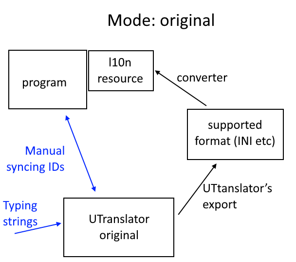

# UTranslator: translation tool for Unicodia

A simple offline tool for: a) making original text; b) translating it.

As it is designed for open-source projects, no patch translations here.

UTranslator is designed for continuous translation when programmer modifies original, and translator translates what he did, keeping track of what was already translated.

**Lifecycle phase: 3** (alpha). Actually used by people close to developer though not ready for general public. Architecture is obvious.

## Why?

Most of Unicodia’s texts are wiki. So it is hard to edit them in marked-up format like XML.

## Portable version

Set in “UTranslator.xml” file “portable=1”

## Simplified working processes

#### Original: you just edit original strings


## Supported formats

1. Simple INI

```
[Group1.Group2]
Key="string"
```

2. Qt UI (read only)

## Interesting data

https://poeditor.com/localization/files/qt-ts :: A few L10n samples